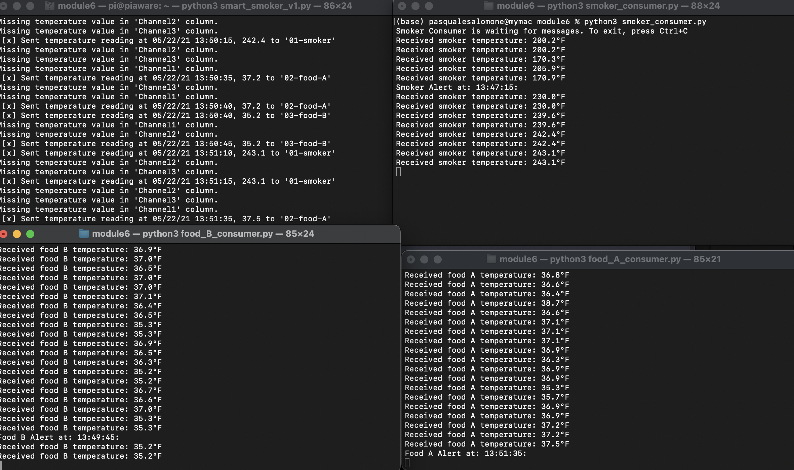
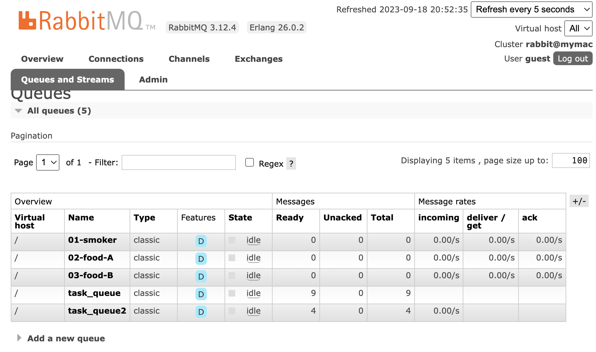

# Project Title: streaming-06-smart-smoker-alert

Author: Pasquale Salomone<br>
Date: September 19, 2023

The purpose of this project is to create a comprehensive monitoring and alert system for temperature-sensitive environments, such as a smoker and food  smoking processes, using RabbitMQ message queues and Python scripts. The project consists of multiple components: Smoker Producer, Smoker Consumer, Food A Consumer, and Food B Consumer. Each consumer is responsible for receiving temperature data messages, decoding and processing them, and triggering alerts based on predefined conditions:
- If smoker temp decreases by 15 F or more in 2.5 min (or 5 readings)  --> smoker alert!
- If food temp change in temp is 1 F or less in 10 min (or 20 readings)  --> food stall alert!

## Prerequisites

1. Git
1. Python 3.7+ (3.11+ preferred)
1. VS Code Editor
1. VS Code Extension: Python (by Microsoft)

The following modules are required: 


| Module          | Version  |
|-----------------|----------|
| csv             | 1.0      |
| webbrowser      | 3.11.4   |
| sys             | 3.11.4   |
| time            | 3.11.4   |
| pika            | 1.3.2    |
| collections     | 3.11.4   |

## Notes

I did not implement the logging functionality for either producer or consumer. Also, why testing the alerts,  I changed the csv file to speed up the process. I uploaded the original csv file in the repo. I implemented a process to clean deque after the scheduled readings (5 for the smoker, and 20 for the food monitors). Below is an example from the smoker consumer:
```
# Clear the deque every 5 readings
        if len(smoker_temperature_deque) % 5 == 0:
            smoker_temperature_deque.clear()
```

## Terminals Screenshots

See a running example:






## Suggested Readings

1. Read the [RabbitMQ Tutorial - Work Queues](https://www.rabbitmq.com/tutorials/tutorial-two-python.html)


2. [RabbitMQ Tutorial - Work Queues](https://www.rabbitmq.com/tutorials/tutorial-two-python.html)

3. [Deque Info](https://www.geeksforgeeks.org/deque-in-python/)

## Acknowledgments

I would like to acknowledge both Stackoverflow and ChatGPT as an instrumental aid in the development of this project.